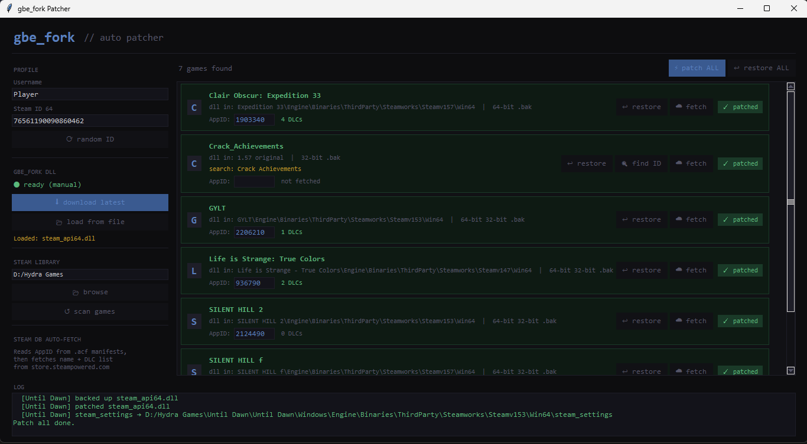

# gbe_fork Auto Patcher

A Windows GUI tool that automatically patches Steam games with the [gbe_fork](https://github.com/Detanup01/gbe_fork) Steam emulator. Scans your Steam library, detects games, fetches info from the Steam Store API, generates all required configs, downloads achievement icons, and replaces `steam_api64.dll` / `steam_api.dll` in one click.

---

## Features

- **Auto-detects Steam library** from the Windows registry, including extra library folders from `libraryfolders.vdf`
- **Recursive DLL scan** — finds `steam_api64.dll` / `steam_api.dll` no matter how deep in the game folder tree
- **AppID from `.acf` manifests** — reads `appmanifest_*.acf` files for reliable AppID detection without any API calls
- **Smart name cleaning** — strips repack/scene tags from folder names before searching (e.g. `Until Dawn (SteamRip)` → `Until Dawn`)
- **Steam Store API integration** — auto-fetches official game names and full DLC lists per game
- **AppID search by name** — searches `store.steampowered.com` using the cleaned folder name for games without a manifest
- **Auto-generates all gbe_fork configs** inside `steam_settings/` next to the DLL
- **DLC.txt generation** — writes all DLC entries in gbe_fork format on patch
- **Backup & restore** — renames the original DLL to `.bak` before patching; one-click restore
- **Persistent config** — saves all settings to `patcher_config.json` so nothing needs to be re-entered on restart
- **Download gbe_fork DLL automatically** from the latest GitHub release, or load one manually
- **Achievement tab** — browse, unlock, and lock achievements per game
- **Achievement schema fetch** — pulls full achievement definitions (name, description, icons) via Steam API
- **Local icon download** — saves color and gray achievement icons to `steam_settings/images/` and patches `achievements.json` with local paths
- **Configurable Steam API key** — stored in `patcher_config.json`, editable from the UI

---

## Requirements

- Windows 10 / 11
- Python 3.8 or newer
- [Pillow](https://pypi.org/project/pillow/) — for achievement icon display (`pip install pillow`)
- No other external packages — uses only Python standard library

---

## Running from source

```bash
pip install pillow
python patcher.py
```

---

## Building a standalone `.exe`

Run `build.bat` on Windows. It installs PyInstaller + Pillow and produces `dist\gbe_fork_Patcher.exe`.

```
build.bat
```

---

## First-time setup

1. Launch the app — it auto-detects your Steam library and scans for games.
2. Click **⬇ download latest** to fetch the gbe_fork DLL from GitHub, or **📂 load from file** to use one you already have.
3. Set your **Username** and **Steam ID 64** in the left panel (a random ID is pre-filled).
4. Enter your **Steam API Key** in the left panel (a default key is pre-filled).
5. Click **🔍 search AppIDs by name** to auto-fill missing AppIDs, then **⬇ fetch ALL from Steam** to pull game names and DLC lists.
6. Click **⚡ patch ALL** to patch every game, or **⚡ patch** on individual games.

All settings are saved automatically to `patcher_config.json` and restored on next launch.

---

## How patching works

For each game the patcher:

1. Locates the exact folder containing `steam_api64.dll` or `steam_api.dll` (walks the full directory tree)
2. Renames the original DLL to `steam_api64.dll.bak` (backup)
3. Writes the gbe_fork DLL in its place
4. Creates `steam_settings/` next to the DLL containing:

| File | Purpose |
|---|---|
| `configs.main.ini` | Networking, overlay, DLC unlock |
| `configs.user.ini` | Username and Steam ID |
| `configs.app.ini` | App-specific settings |
| `configs.overlay.ini` | Overlay position and options |
| `DLC.txt` | All DLC AppIDs with names |
| `achievements.json` | Achievement definitions with local image paths |
| `images/` | Downloaded achievement icons (color + gray) |

5. Writes `steam_appid.txt` next to the DLL and at the game root
6. Fetches achievement schema in the background and downloads all icons

---

## Generated config contents

**`configs.main.ini`**
```ini
[main::connectivity]
disable_networking=0
disable_overlay=0
disable_lan_only=0

[main::general]
unlock_all_dlc=1
enable_experimental_overlay=1
```

**`configs.user.ini`**
```ini
[user::general]
account_name=YourName
account_steamid=76561198012345678
language=english
```

**`DLC.txt`**
```
1234561=Season Pass
1234562=Expansion Pack 1
1234563=Soundtrack
```

**`achievements.json`** (example entry)
```json
[
  {
    "name": "ACH_WIN_DUEL",
    "displayName": "Duelist",
    "description": "Win 10 duels",
    "hidden": "0",
    "icon": "images/ACH_WIN_DUEL.jpg",
    "icongray": "images/ACH_WIN_DUEL_gray.jpg"
  }
]
```

---

## Achievement tab

Select a game from the dropdown at the top of the **🏆 achievements** tab, then:

- **⬇ fetch schema** — downloads achievement definitions + all icons from Steam API
- **↺ reload saves** — re-reads the gbe_fork save file from disk
- **✓ unlock** / **○ lock** — toggle individual achievements instantly
- **✓ unlock ALL** / **○ lock ALL** — bulk operations
- Filter by `all`, `✓ unlocked`, or `○ locked`
- Search by name or description

Achievement save state is read from and written to:
```
%APPDATA%\GSE Saves\<AppID>\stats\achievements.json
```

---

## Achievement icon pipeline

When schema is fetched:

1. Downloads color icon (`icon`) → `steam_settings/images/<ACH_NAME>.jpg`
2. Downloads gray icon (`icongray`) → `steam_settings/images/<ACH_NAME>_gray.jpg`
3. Replaces URL fields in `achievements.json` with local relative paths

Icons are loaded from disk on subsequent opens — no network needed after first fetch.

---

## Folder name cleaning

Scene/repack folder names are cleaned before searching Steam:

| Folder name | Searched as |
|---|---|
| `Until Dawn (v1.0.3) [SteamRip]` | `Until Dawn` |
| `Cyberpunk.2077_v2.1_Goldberg` | `Cyberpunk 2077` |
| `HollowKnight_v1.5.68.11182` | `HollowKnight` |
| `TheForest (FitGirl Repack)` | `TheForest` |
| `ELDEN.RING.build12345` | `ELDEN RING` |

Stripped tags include: `SteamRip`, `FitGirl`, `CODEX`, `SKIDROW`, `CPY`, `PLAZA`, `Goldberg`, `GOG`, `DODI`, version numbers, build IDs, `Early Access`, `Online Fix`, and more.

---

## Persistent config

`patcher_config.json` (next to the script/exe):

```json
{
  "library_path": "C:\\Program Files (x86)\\Steam\\steamapps\\common",
  "username": "Player",
  "steamid": "76561198012345678",
  "dll_path": "C:\\path\\to\\gbe_steam_api64.dll",
  "steam_api_key": "YOUR_STEAM_API_KEY"
}
```

Saved automatically on close, on library browse, and on DLL load/download. Editable manually.

---

## File structure

```
gbe_patcher/
├── patcher.py              # Main application
├── build.bat               # Build script (.exe via PyInstaller)
├── patcher_config.json     # Auto-generated on first save
├── gbe_steam_api64.dll     # Cached gbe_fork DLL (auto-downloaded)
├── ach_icons/              # Remote icon cache (URL downloads)
└── README.md
```

After patching a game:

```
GameFolder/
├── steam_api64.dll         # gbe_fork DLL (replaced)
├── steam_api64.dll.bak     # Original Steam DLL (backup)
├── steam_appid.txt
└── steam_settings/
    ├── configs.main.ini
    ├── configs.user.ini
    ├── configs.app.ini
    ├── configs.overlay.ini
    ├── DLC.txt
    ├── achievements.json
    └── images/
        ├── ACH_WIN_DUEL.jpg
        ├── ACH_WIN_DUEL_gray.jpg
        └── ...
```

---

## Restoring original DLLs

Click **↩ restore** on a patched game to swap the `.bak` back. Click **↩ restore ALL** to restore everything at once.

---

## Credits

- [gbe_fork](https://github.com/Detanup01/gbe_fork) by **Detanup01** — the Steam emulator this tool patches with
- [Goldberg Steam Emulator](https://gitlab.com/Mr_Goldberg/goldberg_emulator) by **Mr. Goldberg** — the original project gbe_fork is based on
- [Hydra Achievement Manager](https://github.com/TheProjectHAM/hydra-achievement-manager) by **TheProjectHAM** — inspiration for the achievement management features

---

## Disclaimer

This tool is intended for **LAN play, offline use, and development/testing** purposes only. Do not use it to bypass copy protection on games you do not own. The authors take no responsibility for misuse.
